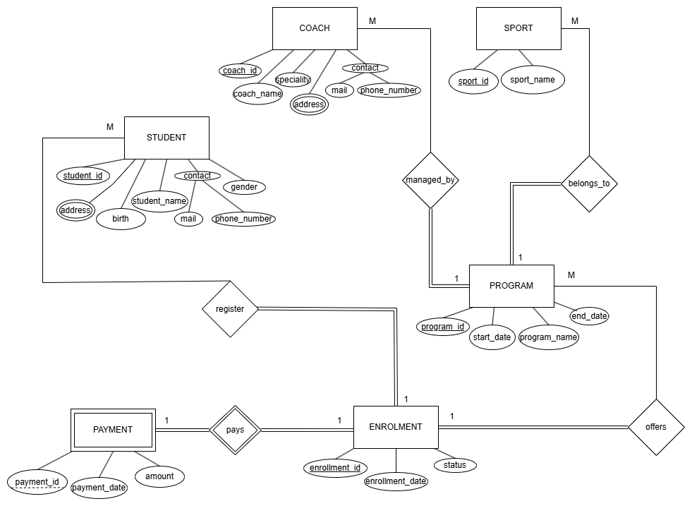
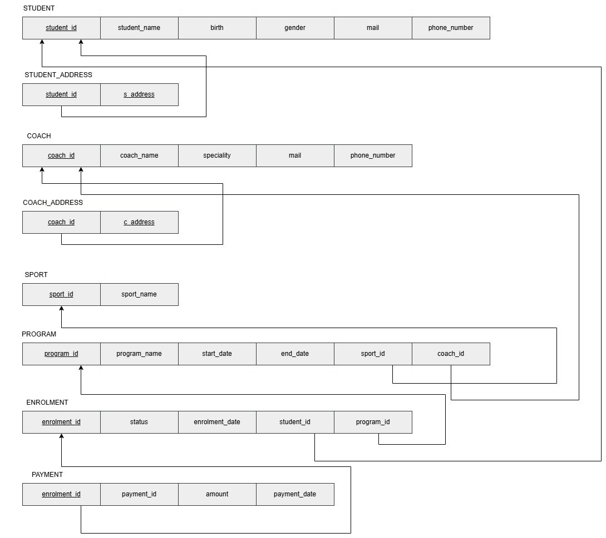

# 🏋️‍♂️ Sports Academy Database System

A streamlined Relational Database Management System (RDBMS) designed to manage the core operations of a sports academy.

## 📌 Features
* **Student & Coach Management:** Tracks demographics, contact details, and multiple addresses.
* **Program Enrollment:** Connects students to specific sports programs (e.g., Football, Tennis).
* **Payment Tracking:** Securely logs financial transactions linked to student enrollments.

## 📊 Database Architecture (Visual Models)
Below are the conceptual and relational models used to ensure data integrity and query efficiency.

### 1. Entity-Relationship (ER) Diagram

### 2. Relational Schema

## 🛠️ Tech Stack
* **Database Engine:** MySQL
* **Language:** SQL (DDL & DML)
* **Design Tools:** Draw.io (Source files included in the repository)

## 🚀 How to Run
1. Clone this repository.
2. Import the `athleticore.sql` file into your MySQL environment (e.g., MySQL Workbench).
3. The schema and sample data will be automatically generated.
